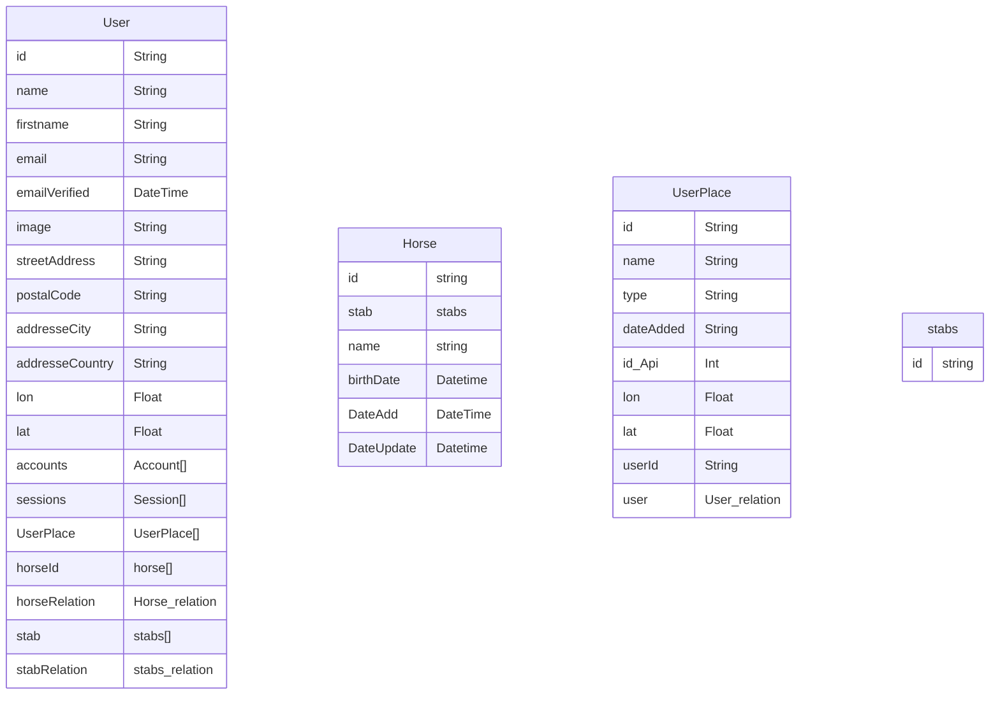

### Userplace

```js
model UserPlace {
    id        String @id @default(cuid()) @map("_id")
    name      String
    type      String
    dateAdded String
    id_Api    Int    @unique
    lon       Float
    lat       Float
    userId    String
    user      User   @relation(fields: [userId], references: [id], onDelete: Cascade)
}
```


### Horse

```js
model Horse {
    id        String @id @default(cuid()) @map("_id")
    name      String
    firstname      String
    dateAdded String
    place      UserPlace   @relation(fields: [userPlaceId], references: [id], onDelete: Cascade)
    userPlaceId string

}
```

### User

```js
model User {
    id        String @id @default(cuid()) @map("_id")
         id              String      @id @default(cuid()) @map("_id")
    name            String?
    firstname       String?
    email           String?     @unique
    emailVerified   DateTime?
    image           String?
    streetAddress   String?
    postalCode      String?
    addresseCity    String?
    addresseCountry String?
    lon             Float?
    lat             Float?
    accounts        Account[]
    sessions        Session[]
    UserPlace       UserPlace[]
    horseId  horse[]
    stab stabs[] 

}
```